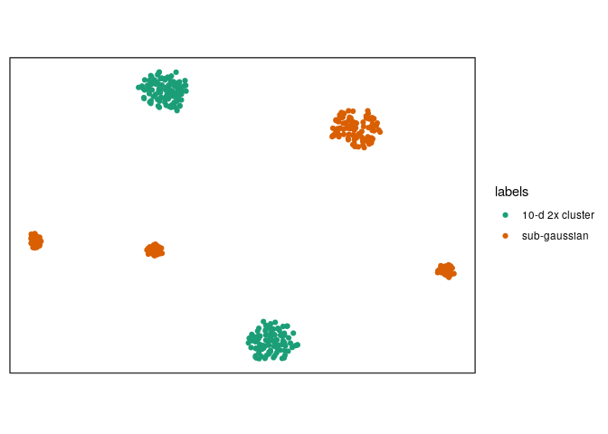
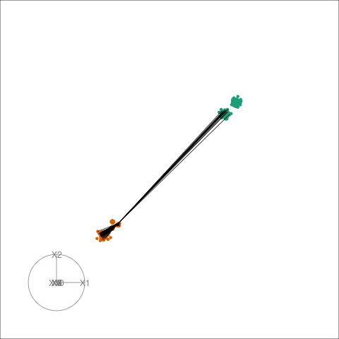

<!-- README.md is generated from README.Rmd. Please edit that file -->
sneezy
======

Explaining t-SNE via diagnostics and tours.

Installation
============

``` r
remotes::install_github("sa-lee/sneezy")
```

Quick start
===========

sneezy comes preloaded with some datasets from the [multi-challenge dataset](http://ifs.tuwien.ac.at/dm/dataSets.html), to start we will subset the data to only consider intertwined rings in three-dimensions.

``` r
library(ggplot2)
library(sneezy)
tworings <- subset(multi, key == "C")
tworings
#> # A tibble: 200 x 12
#>    key   index      X1    X2    X3    X4    X5    X6    X7    X8    X9
#>    <chr> <int>   <dbl> <dbl> <dbl> <dbl> <dbl> <dbl> <dbl> <dbl> <dbl>
#>  1 C         1 -1.06    21.5 0.213     0     0     0     0     0     0
#>  2 C         2 -1.99    20.6 0.213     0     0     0     0     0     0
#>  3 C         3 -1.26    21.4 0.213     0     0     0     0     0     0
#>  4 C         4 -1.71    19.9 0.213     0     0     0     0     0     0
#>  5 C         5  0.309   21.7 0.213     0     0     0     0     0     0
#>  6 C         6  1.75    20.1 0.213     0     0     0     0     0     0
#>  7 C         7  0.671   21.6 0.213     0     0     0     0     0     0
#>  8 C         8  0.396   19.4 0.213     0     0     0     0     0     0
#>  9 C         9 -0.0681  19.4 0.213     0     0     0     0     0     0
#> 10 C        10 -1.92    20.2 0.213     0     0     0     0     0     0
#> # … with 190 more rows, and 1 more variable: X10 <dbl>

pc <- prcomp(tworings[, -c(1,2)])
ggplot(as.data.frame(pc$x), aes(PC1, PC2)) +
  geom_point() +
  coord_fixed(sqrt(pc$sdev[2] / pc$sdev[1]))
```


We can run the equivalent t-SNE, with our simplified wrapper which computes exact t-SNE for a given perplexity. In this case t-SNE has broken the rings but has not preserved the topology.

``` r
set.seed(1999)
coords <- basic_tsne(tworings[, -c(1,2)], perplexity = 30)

ggplot(as.data.frame(coords$Y), aes(V1, V2)) +
  geom_point() +
  coord_fixed(sqrt(pc$sdev[2] / pc$sdev[1]))
```



We can also tour around a data space, and see how the nearest neighbours graph (for the point near the edge of a ring) in t-SNE space moves in high dimensional space:

``` r
library(gganimate)
view_tour(as.matrix(tworings[, c(3,4,5)]), coords, .subset = 131)
#> Using half_range 2.5
```


